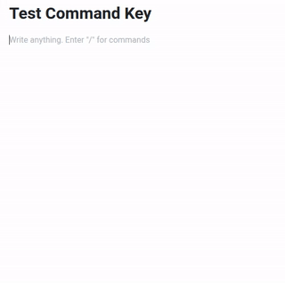
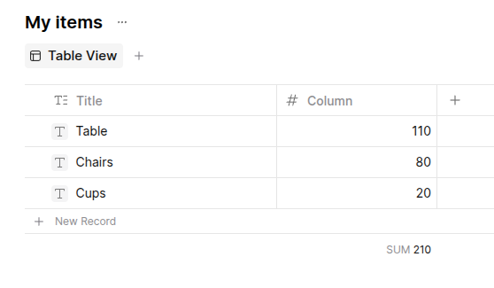
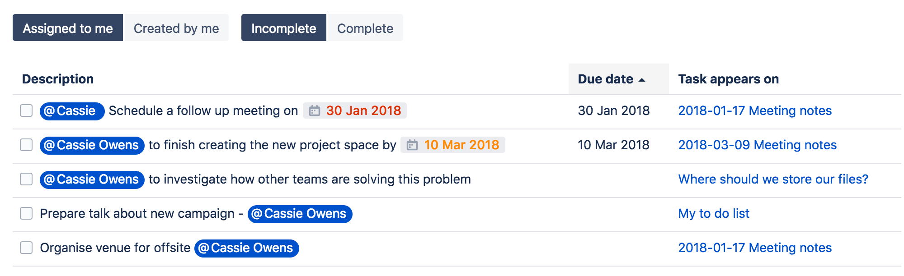

# Knowledge management tool features

# General

## Github Stars

The number of stars on the primary github (or other) source code repository.

## Contributors

The number of contributors that have contributed to the project.

## Last Commit

The date of the last git commit to the project.

## Source Language

The primary language used in the repository's source code.

## License

The software license listed on the code repository.

## First release

In which year was the first public release (not just a commit, but a release)

## Freeness

Is the project completely and forever 'Free', or does it have a subscription plan or support model

## Framework

Framework with which the editor was built

| Name                                                     | Initial release | Stars |
| -------------------------------------------------------- | --------------- | ----- |
| [Flutter](https://flutter.dev/) (created by Google)      | 2017            | 171k  |
| [Blocksuite](https://github.com/toeverything/blocksuite) | 2022            | 5.1k  |
| [ProseMirror](https://prosemirror.net/) (e.g Atlassian)  | 2016            | 8.2k  |
| [Tiptap](https://tiptap.dev/) (has commercial plans)     | 2022            | 31.4k |

# Accessibility

## Demo

Does the project provide a demo instance

## Web App

Is an instance accessible via browser

# Features

## Command key

Key shortcut to open formatting options and features. Much easier than a keyboard shortcut for each individual feature

## Drag-n-Drop pages

Can you move pages around in the page tree via drag and drop

## Database

Table with functionality such as count, sum, etc...

Sometimes called table view, grid, database

## View assigned tasks

Show all tasks assigned to a particular user. [Example](https://confluence.atlassian.com/doc/add-assign-and-view-tasks-590260030.html) from Confluence

# Embed 3rd party services

Many of the services can also be included via an embed link which forwards you onto the 3rd party site. However, for content rendering on the page, a particular service must be explicitly supported

## Diagrams.net

**draw.io** was the original name of the web-based diagramming software. In 2020, it was renamed to diagrams.net, but the original name draw.io is still used sometimes

# Administration

# Authentication

# User Management

# Table Support

## Images

Can you paste an image in your clipboard to a 

# Installation

# Business model

