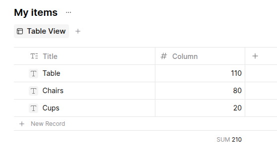

# Knowledge management tool features

## Github Stars

The number of stars on the primary github (or other) source code repository.

## Contributors

The number of contributors that have contributed to the project.

## Last Commit

The date of the last git commit to the project.

## Source Language

The primary language used in the repository's source code.

## License

The software license listed on the code repository.

## First release

In which year was the first public release (not just a commit, but a release)

## Freeness

Is the project completely and forever 'Free', or does it have a subscription plan or support model

## Framework

## Web App

## Demo

Does the project provide a demo instance

## Database

Table with functionality such as count, sum, etc...

Sometimes called table view, grid, database

